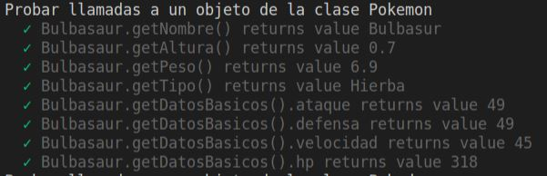
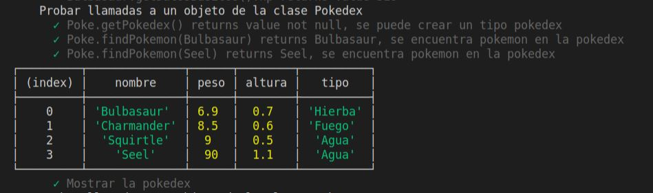
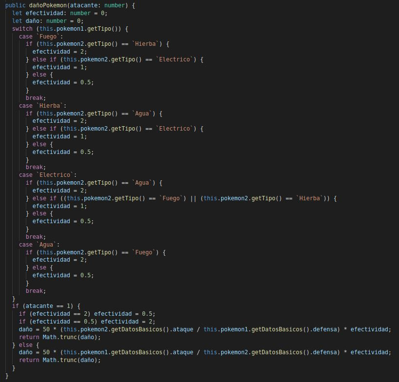
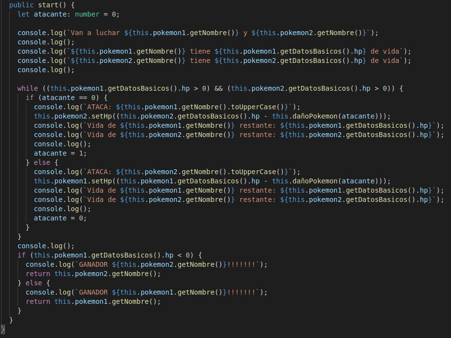
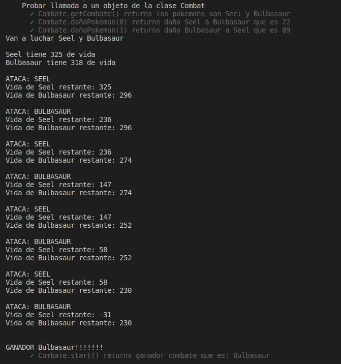

# INFORME PRACTICA 5
## Objetos, clases e interfaces
### ALBERTO RIOS DE LA ROSA
### alu0101235929@ull.edu.es

### INTRODUCCIÓN

Esta práctica tiene como objetivo principal continuar en la realización de ejercicios de programación en TypeScript, centrándonos más en ejercicios relacionados con objetos, clases e interfaces, para así seguir evolucionando en nuestro aprendizaje. Al igual que las siguientes practicas se deberá desarrollar la documentación y la realización de pruebas mediante la metodología TDD. Primero explicaremos en un principio como crear este método de manera breve, y más tarde mostraremos la solución de cada uno de los ejercicios propuestos, que al tener varios ficheros cada ejercicio se encontrará resuelto en una carpeta dentro de la src para cada ejercicio, con una breve explicación de cada uno y unas capturas de pantalla en el que se muestra que se han superado las distintas pruebas de ese ejercicio junto al link de donde se crearon las pruebas. Si desea leer los enunciados de cada ejercicio los podrás encontrar pinchando [aqui](https://ull-esit-inf-dsi-2021.github.io/prct05-objects-classes-interfaces/)

### CREACION DEL PROYECTO CON LA ESTRUCTURA REQUERIDA

Para crear el proyecto primero debemos realizar un git clone, de la estructura de git dada para el desarrollo y la entrega del mismo, mas tarde al igual que la práctica anterior debemos seguir los pasos de la creacion de un proyecto para trabajar en TypeScript a partir del siguiente [enlace](https://ull-esit-inf-dsi-2021.github.io/typescript-theory/typescript-project-setup.html). Ya creado el proyecto inicial, lo siguiente que vamos a crear es los ficheros y carpetas necesarios para poder elaborar la documentación de cada uno de los ejercicios, encontrandolos en este [video](https://drive.google.com/file/d/19LLLCuWg7u0TjjKz9q8ZhOXgbrKtPUme/view). Después por último para ya tener la estructura de nuestro proyecto terminada, a través de mocha y chai, crearemos lo necesario para poder seguir la metodología TDD, en el que se desarrolla la prueba y luego el método, teniendolo disponible en este [video](https://drive.google.com/file/d/1-z1oNOZP70WBDyhaaUijjHvFtqd6eAmJ/view). Para hacernos una idea de la estructura final del proyecto, debe ser algo parecido a lo siguiente:

### ELABORACIÓN DE LOS EJERCICIOS

### Ejercicio 1 - Pokedex

 - ___Carpeta con el código resuelto___ = [Solución](https://github.com/ULL-ESIT-INF-DSI-2021/ull-esit-inf-dsi-20-21-prct05-objects-classes-interfaces-Espinette/tree/master/src/ejercicio-1)
 
 - ___Fichero con las pruebas___ = [Prubas](https://github.com/ULL-ESIT-INF-DSI-2021/ull-esit-inf-dsi-20-21-prct05-objects-classes-interfaces-Espinette/blob/master/tests/ejercicio-1.spec.ts)

 - ___Explicación de cada clase___

    1. ___Clase Pokemon___:
      
        Esta clase sirve para crear un objeto de tipo pokemon, su constructor recibe el nombre del pokemon, su peso, la altura, el tipo de pokemon y un vector con uns estadisticas básicas, que son su ataque, defensa, velocidad y vida. Además, hemos creado los metodos getters y setters para así poder acceder a los atributos ya que son privados de la clase. Encontrará la clase pulsando [aquí.](https://github.com/ULL-ESIT-INF-DSI-2021/ull-esit-inf-dsi-20-21-prct05-objects-classes-interfaces-Espinette/blob/master/src/ejercicio-1/pokemon.ts). Pruebas superadas:
        
         
        
    2. ___Clase Pokedex___:

        Esta clase sirve para introcuir en un objeto pokedex todos los pokemons que queramos tener dentro de esta, por lo que su constructor solo recibre un parametro que es un vector de pokemons, además creamos los metodos get y set para la clase, además de un metodo `findPokemon()` que sirve para ver si un pokemon se encuentra dentro de la pokedex y una funcion `mostrarPokedex()` que muestra una tabla con los pokemons y sus atributos en el objeto. Encontrará la clase pulsando [aquí.](https://github.com/ULL-ESIT-INF-DSI-2021/ull-esit-inf-dsi-20-21-prct05-objects-classes-interfaces-Espinette/blob/master/src/ejercicio-1/pokedex.ts). Pruebas superadas y tabla mostrada:
        
          
    
    3. ___Clase Combat___:

        Esta clase recibirá como parámetros dos obetos tipo pokemon y tiene como objetivo principal la simulación de un combate entre los dos pokemons. Tenemos el método `getCombate()` que lo único que hace es retornar los pokemons que se van a pelear. Luego tenemos otra función muy parecida a la que ya usamos para otra práctica, concretamente el ejercicio 9 de la práctica 3, esta es `dañoPokemon(numero)`, se diferencia en que esta recibe un parametro por pantalla que puede ser o 0 o 1, dependiendo de que pokemon ataque en dicho momento. La funcion es la siguiente:  
        
          
         
         Como podemos ver primero tenemos un switch en el que calculamos la efectividad que tendría el pokemon1 respecto al pokemon2, ya obtenido ese valor, tenemos un if para ver si al que le toca atacar es el pokemon 2, en ese caso, el valor de la efectividad cambia al opuesto, es decir si es 2 pasa a ser 0.5 y vicerversa, y en el caso de ser 1 se queda igual. Por última con la fórmula para calcular el daño obtenemos dicho valor y lo retornamos. Ya creada esta función disponemos de la función `start()` que es donde se simulará el combate e irá mostrando el desenlace del siguiente. La funcion es:
         
          
         
         Primero realizamos varios console.log para indicar que pokemons pelean y la vida con la que empiezan cada uno y una variable atacante que se inicia en 0 pero cambiará a 1 para que así cada vez ataque un pokemon a otro. Luego creamos un bucle `while` en el que mientras los dos pokemons tengan más de 0 de vida se sigan combatiendo. Dentro de este bucle habrá una condicion if para ver que pokemon de los dos le toca a atacar. Se mostrará por pantalla que le toca a a tacar a dicho pokemon, se le adjucica la nueva vida restando al pokemon atacado restando su vida actual menos el daño, y se mostrará la vida resultante de ambos pokemons, además de cambiar el valor de la variable atacante para adjudicar el turno al otro pokemon. Por último ya fuera del bucle while, se mostrará el pokemon vencedor del combate. encontrará la clase completa [aquí](https://github.com/ULL-ESIT-INF-DSI-2021/ull-esit-inf-dsi-20-21-prct05-objects-classes-interfaces-Espinette/blob/master/src/ejercicio-1/combat.ts). Un ejemplo de combate y las pruebas de la clase son:

          

